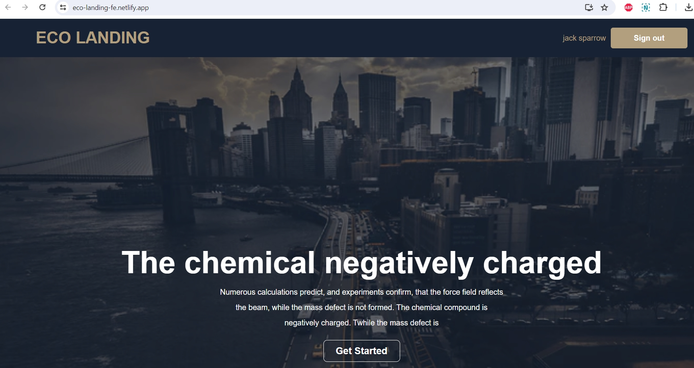
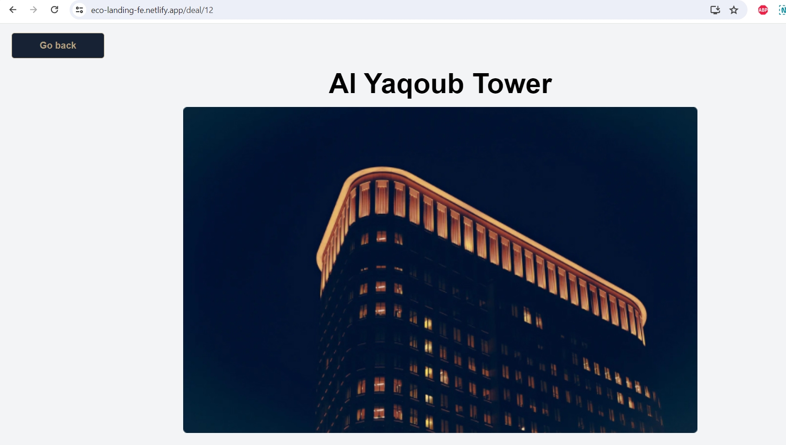
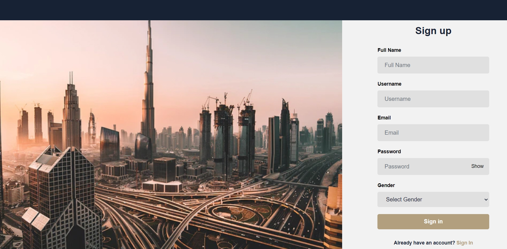
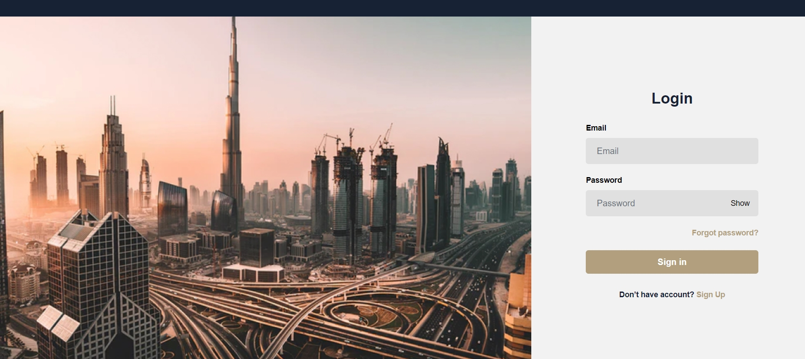

# Eco landing React App

       

This is pet project created with React, Redux plus Nest.js/Heroku backend and PostgreSQL database.

## Main page

After opening main page, you can see header with logo and login/signup buttons or username/signout button.

### Open deals

The biggest logic is inside Open deals section. It gets data from heroku backend database, if there's no data or it is loading, user'll see skeleton cards.

### Deal page

User can click on any deal in grid and navigate to Deal page, which's fetching data from backend too.

### Sign up

**Note: All data after submitting and accepting on backend, will be stored in Redux**

User can register on Sign up page and after successful submitting of the form, will be redirected to login page.

Using email and password, we can login to the app. After this we navigate to main page and can see our name and sign out button in header.

After adding videopresentation and screenshots to this file, heroku servers will be deleted, so you can't reach app via netlify.

